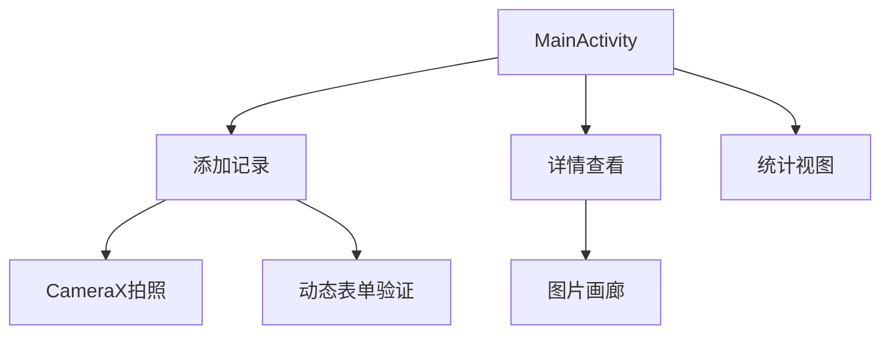

# TastyLog美食日志

### **1. 应用定位**
轻量级美食记录工具，专注个人用餐体验的数字化管理，核心功能控制在4个主要界面内

---

### **2. 核心功能**
| 功能模块       | 实现要点                            | 技术关联                |
| -------------- | ----------------------------------- | ----------------------- |
| **用餐记录**   | 餐厅选择/自定义、菜品拍照、评分系统 | CameraX + Room          |
| **时间线浏览** | 按时间倒序排列的卡片列表            | RecyclerView + CardView |
| **智能统计**   | 消费金额/评分分布图表               | MPAndroidChart          |
| **分类检索**   | 按餐厅类型/评分/价格过滤            | SearchView + LiveData   |

---

### **3. 技术实现方案**
#### **UI架构设计**


#### **特色控件组合**
1. **智能评分输入**：结合RatingBar与SeekBar的混合控件
2. **动态价格标签**：根据金额自动变换背景色的Chip控件
3. **时间线分隔线**：带月份标记的ItemDecoration
4. **照片滤镜**：集成PhotoFilter SDK的简易图片处理

#### **存储结构设计**
```kotlin
@Entity(tableName = "food_journal")
data class FoodJournal(
    @PrimaryKey val id: String = UUID.randomUUID().toString(),
    val restaurantName: String,
    val mealType: String, // 早餐/午餐/晚餐
    val rating: Float,    // 0-5分
    val cost: Int,        // 单位：元
    val photoPath: String?,
    @TypeConverters(DateConverter::class)
    val date: Date
)
```

---

### **4. 创新实现细节**
#### **动态表单验证**
```kotlin
// 自定义TextInputLayout验证逻辑
fun validateForm() {
    val nameError = when {
        binding.etRestaurant.text.isNullOrEmpty() -> "必填项"
        binding.etRestaurant.text!!.length > 20 -> "名称过长"
        else -> null
    }
    binding.tilRestaurant.error = nameError
}
```

#### **智能价格提示**
```xml
<com.google.android.material.chip.Chip
    android:id="@+id/priceChip"
    app:chipBackgroundColor="@color/price_chip_color"
    app:chipCornerRadius="16dp"
    tools:text="¥ 128"/>
```

```kotlin
// 根据金额动态设置颜色
when {
    cost < 50 -> R.color.price_low
    cost in 50..150 -> R.color.price_normal
    else -> R.color.price_high
}
```

---

### **5. 开发阶段规划**
**第一周**  
- 完成基础数据模型设计  
- 实现CameraX拍照功能  
- 搭建主界面RecyclerView  

**第二周**  
- 完善表单验证逻辑  
- 集成Room数据库  
- 开发详情页布局  

**第三周**  
- 实现统计图表功能  
- 添加搜索过滤功能  
- 优化UI动效  

**第四周**  
- 测试数据持久化  
- 适配不同屏幕尺寸  
- 准备演示素材  

---

### **6. 作业报告建议框架**
```markdown
# TastyLog开发报告

## 一、核心价值
- 解决外出就餐后容易遗忘体验细节的痛点
- 建立个人化的美食评价体系

## 二、技术亮点
1. **混合输入控件**：整合评分与价格输入逻辑
2. **智能颜色系统**：基于金额自动生成视觉提示
3. **时间轴布局**：采用自定义ItemDecoration实现时间分隔线

## 三、关键代码示例
餐厅类型选择对话框：
```kotlin
MaterialAlertDialogBuilder(context)
    .setTitle(R.string.select_restaurant_type)
    .setItems(R.array.restaurant_types) { _, which ->
        binding.autoCompleteTextView.setText(resources.getStringArray(R.array.restaurant_types)[which])
    }
    .show()
```

## 四、界面演进过程
| 版本 | 改进要点     |
| ---- | ------------ |
| V1.0 | 基础记录功能 |
| V1.2 | 增加照片滤镜 |
| V1.5 | 完善统计模块 |

## 五、效果展示
| 主界面时间线 | 拍照界面 | 统计图表 |
| ------------ | -------- | -------- |
| ![主页]      | ![拍照]  | ![统计]  |
